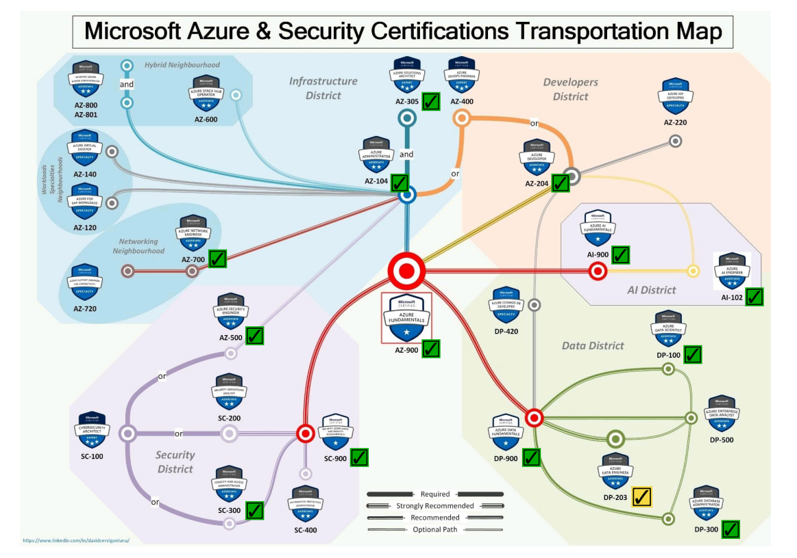

# A Guide to Microsoft Azure: Fundamentals, Development, Data Science

In this repository I collect my notes on the different services provided by Cloud Platform Microsoft Azure.

I have structured the project in the following sections:

- [`01_fundamentals/`](./01_fundamentals/): Contents for the [Exam AZ-900: Microsoft Azure Fundamentals](https://learn.microsoft.com/en-us/credentials/certifications/exams/az-900/). Created after following the Udemy tutorial/course by Scott Duffy [AZ-900: Microsoft Azure Fundamentals Exam Prep](https://www.udemy.com/course/az900-azure/).
- [`02_developer/`](./02_developer/): Contents for the [Exam AZ-204: Microsoft Azure Developer Associate](https://learn.microsoft.com/en-us/credentials/certifications/azure-developer/). Created after following the Coursera/Microsoft **Profesional Certificate** [Microsoft Azure Developer Associate (AZ-204)](https://www.coursera.org/professional-certificates/azure-developer-associate).
- [`03_data_science/`](./03_data_science/): Contents for the [Exam DP-100: Microsoft Azure Data Scientist Associate](https://learn.microsoft.com/en-us/credentials/certifications/azure-data-scientist). Created after following the Coursera/Microsoft **Profesional Certificate** [Microsoft Azure Data Scientist Associate (DP-100)](https://www.coursera.org/professional-certificates/azure-data-scientist).
<!--
- [`04_data_engineering/`](./04_data_engineering/): Contents for the [Exam DP-203: Microsoft Azure Data Engineering Associate](https://learn.microsoft.com/en-us/credentials/certifications/azure-data-engineer). Created after following the Coursera/Microsoft **Profesional Certificate** [Microsoft Azure Data Engineering Associate (DP-203)](https://www.coursera.org/professional-certificates/microsoft-azure-dp-203-data-engineering).
-->

For an overview of all the Azure certifications, check the Azure Certification Subway map by [David Cervigón Luna](https://www.linkedin.com/in/davidcervigonluna/)

Mikel Sagardia, 2024.  
No guarantees.
